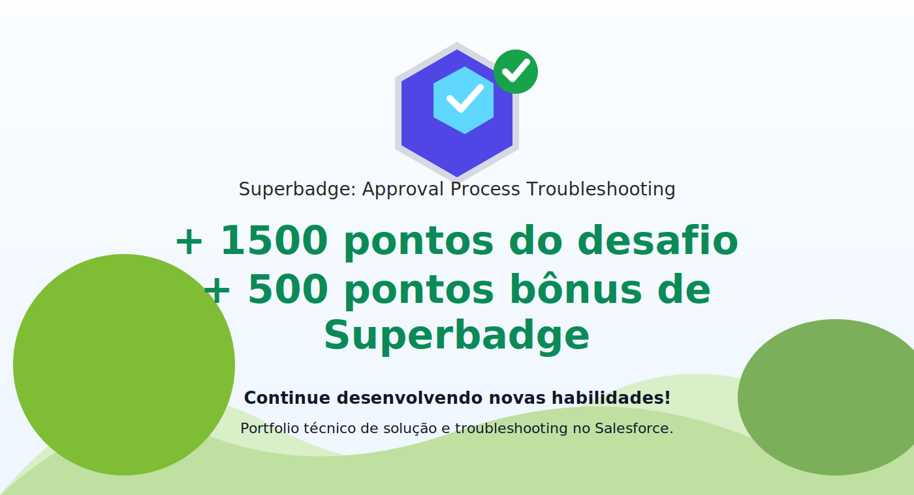

# Superbadge: Approval Process Troubleshooting

<p align="center">
  
</p>

<p align="center">
  
</p>

<p align="center">
  Solucao enxuta e documentada para o superbadge <strong>Approval Process Troubleshooting</strong> no Salesforce.
</p>

<p align="center">
  
  
  
  
</p>

## Visao Geral

Este repositório reúne apenas o essencial para reproduzir a configuracao final do superbadge **Approval Process Troubleshooting**.

O projeto foi organizado para publicar no GitHub somente:

- metadata relevante do desafio
- documentacao profissional do processo
- automacao de CI/CD para validacao e deploy manual

## Resultado Final

<p align="center">
  
</p>

## O Que Foi Implementado

### 1. Troubleshooting do envio para aprovacao

- Ajuste dos `allowed submitters` no approval process `Research Proposals Ready for Review`
- Liberacao do envio por usuarios com role `Research Manager`
- Correcao da visibilidade do botao `Submit for Approval` na Lightning Record Page
- Validacao da submissao correta do registro `Sole Society: Greener Kicks` por `Jose Figueroa`

### 2. Delegated approver e notificacoes

- Habilitacao de delegacao no primeiro step do approval process
- Configuracao de `Jose Figueroa` com `María Concepción Morales` como delegated approver
- Ajuste da preferencia do usuario Maria para receber notificacoes como delegated approver
- Reforco das configuracoes de notificacao por email no fluxo de aprovacao

### 3. Controle de registros em revisao

- Criacao do campo `In_Review__c`
- Criacao das acoes:
  - `Set In Review to True`
  - `Set In Review to False`
- Atualizacao do approval process para marcar e desmarcar o status de revisao
- Criacao da list view `Proposals In Review`

### 4. Roteamento de aprovacao

- Criacao da queue `Research Proposal Approvers`
- Inclusao do role `Research Manager` na queue
- Atualizacao do primeiro step para usar os aprovadores esperados pelo desafio

## Estrutura do Projeto

```text
.
├── .github/
│   └── workflows/
│       ├── ci.yml
│       └── deploy.yml
├── docs/
│   └── images/
├── force-app/
│   └── main/
│       └── default/
│           ├── approvalProcesses/
│           ├── flexipages/
│           ├── objects/
│           ├── profiles/
│           ├── queues/
│           ├── tabs/
│           └── workflows/
├── .forceignore
├── .gitignore
├── LICENSE
├── README.md
└── sfdx-project.json
```

## Principais Arquivos

- `force-app/main/default/approvalProcesses/Research_Proposal__c.Research_Proposals_Ready_for_Review.approvalProcess-meta.xml`
- `force-app/main/default/flexipages/Research_Proposal_Record_Page.flexipage-meta.xml`
- `force-app/main/default/objects/Research_Proposal__c/fields/In_Review__c.field-meta.xml`
- `force-app/main/default/objects/Research_Proposal__c/listViews/Proposals_In_Review.listView-meta.xml`
- `force-app/main/default/queues/Research_Proposal_Approvers.queue-meta.xml`
- `force-app/main/default/workflows/Research_Proposal__c.workflow-meta.xml`

## Como Publicar no GitHub

### 1. Inicializar o repositório

```bash
git init
git branch -M main
git remote add origin https://github.com/stampini81/superbadge-approval-process-troubleshooting.git
```

### 2. Versionar o conteudo essencial

```bash
git add .
git commit -m "docs: finalize approval process troubleshooting superbadge"
git push -u origin main
```

## Como Fazer Deploy para um Org Salesforce

### 1. Autenticar no org

```bash
sf org login web --alias devhub-local --instance-url https://login.salesforce.com
```

### 2. Fazer deploy do metadata

```bash
sf project deploy start --target-org devhub-local --source-dir force-app
```

## CI/CD com GitHub Actions

### CI

O workflow `ci.yml` executa:

- verificacao da existencia dos arquivos essenciais do desafio
- validacao de XML do metadata versionado

### CD

O workflow `deploy.yml` executa deploy manual para Salesforce via `workflow_dispatch`.

Para usar o deploy no GitHub:

1. crie o secret `SF_AUTH_URL`
2. rode o workflow manualmente em `Actions`

Gerando o auth URL:

```bash
sf org display --target-org devhub-local --verbose
```

Use o valor de `sfdxAuthUrl` como secret no repositório.

## Imagens do README

Os visuais do README foram preparados em `docs/images/`.

Arquivos usados:

- `docs/images/salesforce-logo.svg`
- `docs/images/superbadge-badge.svg`
- `docs/images/superbadge-earned.svg`
- `docs/images/trailblazer-team.svg`

Se quiser trocar pelos arquivos originais enviados no chat, basta substituir esses arquivos mantendo os mesmos nomes.

## Autor

**Leandro da Silva Stampini**

## Licenca

Este projeto esta licenciado sob a [MIT License](LICENSE).

## Agradecimentos

<p align="center">
  
</p>

Construido para registrar a conclusao do superbadge e servir como portfolio tecnico de configuracao Salesforce.
